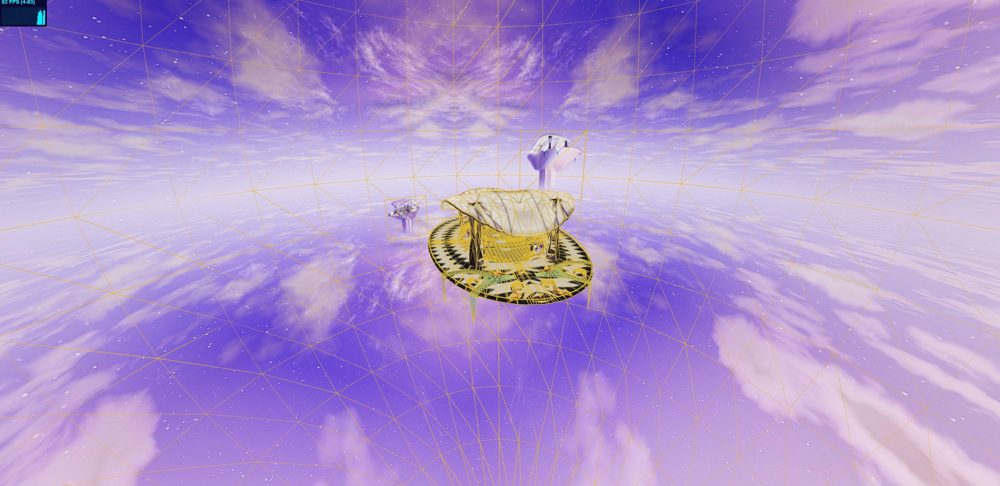
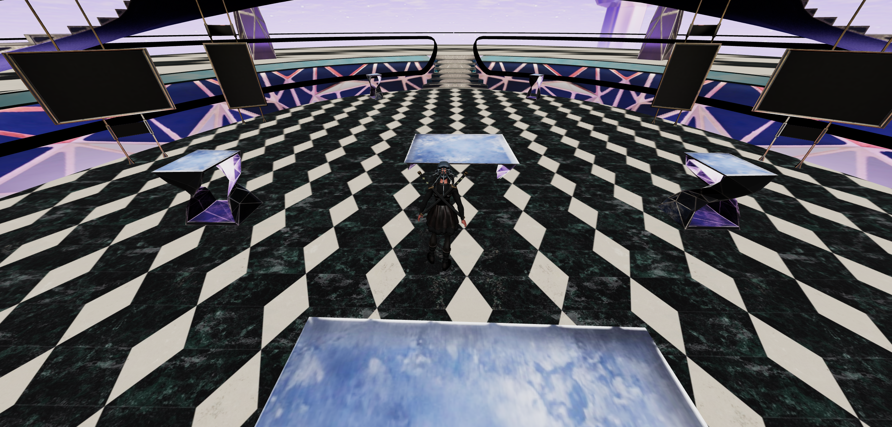

# StudySphere NPC Universe on web browser

Have a voice conversation in a 3D Environment with an AI powered character.

## Getting Started
```bash
cd ss_3Dv

npm install
npm run dev
```
**Platform Example:**




**Third Person Camera:**

When `w` `s` is pressed the character should rotate towards the camera and then impulse should be applied. To achieve this we calculate the angle between camera and character first and rotate the character when moving towards the camera.


**Direction offset:**

Direction offset is calculate for the movement of character on the floor. Imagine the character moving on the floor from eagle eye view. This function helps in calculating the direction offset to know which direction to move the character on the floor.
